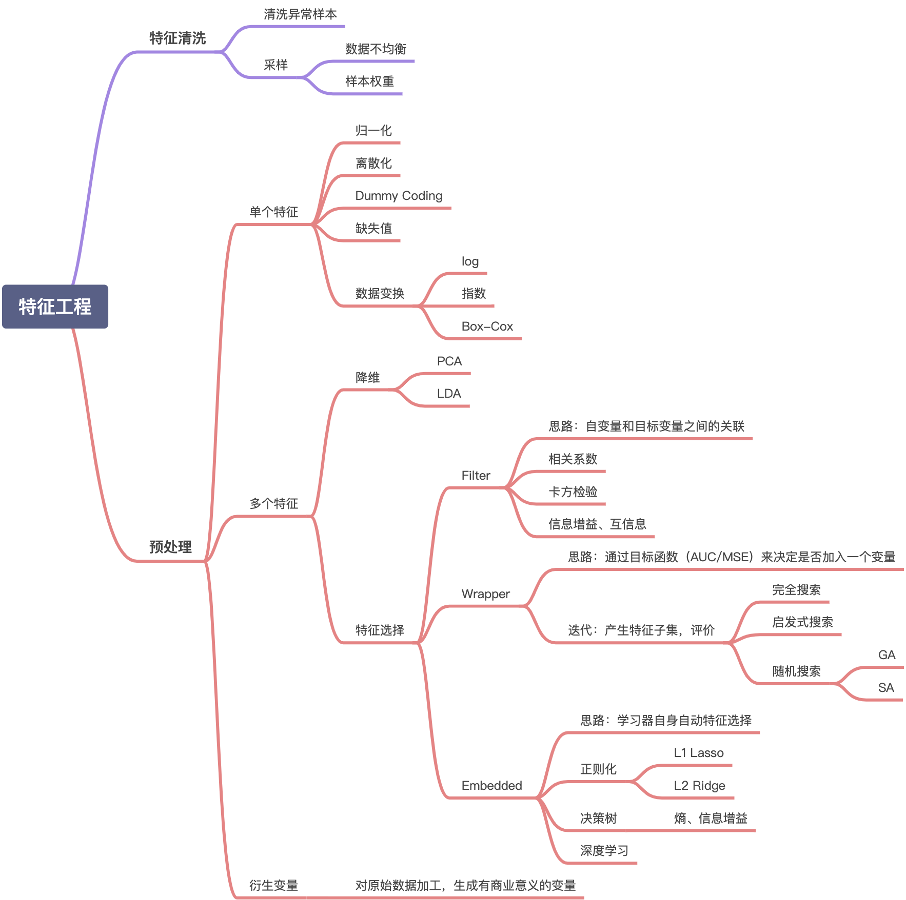

# Thinking
## 1.CTR数据中的类别数据处理，编码方式有哪些，区别是什么
LabelEncoder和OneHotEncoder
LabelEncoder 是对不连续的数字或者文本进行编号，在标签编码之后，我们可能会混淆我们的模型，认为一个列有某种顺序或层次的数据
OneHotEncoder 用于将表示分类的数据扩维，它的值只有0和1，不同的类型存储在垂直的空间。使用one-hot编码，将离散特征的取值扩展到了欧式空间，离散特征的某个取值就对应欧式空间的某个点。
## 2.对于时间类型数据，处理方法有哪些
时间间隔，提取年月日时分秒星期，季度，结合当地时间是否节假日，是否工作日，是否周末等

## 3.你是如何理解CTR预估中的特征组合的，请举例说明
特征组合可以加入非线性表达，提高复杂关系的拟合能力，增强模型的表达能力
例如做影视推荐模型的时候，原始输入特征有年龄、性别（男，女）、用户类型（已工作，学生），类型（电影，电视剧）4个特征信息，它的标签是（观看/未观看），根据这些信息构造决策树，可以得到4种特征组合的方式：1）年龄30性别=女，2）年龄30类型=电视剧，3)用户类型=已工作类型=电影，4）用户类型=已工作年龄=30

## 4.DCN和xDeepFM都可以进行自动特征组合，有何区别
DCN提出了新的算子，用于得到交叉特征，与FM相比，DCN拥有更高的计算效率并且能够提取到更高阶的交叉特征（bit-wise）
xDeepFM在DCN基础上进行了改进，交互特征是在vector-wise层
DCN的Cross在输出层输出全部结果，而CIN在每层都输出中间结果

## 5.今天讲解的特征组合只是特征工程中的一部分，你理解的特征工程都包括哪些，不防做个思维导图
